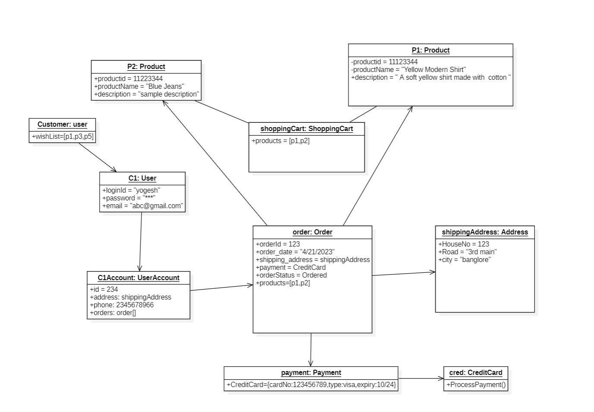

# Object Diagram

Closely related to Class Diagram

Object Diagram provides a **Snapshot of a class diagram** at a particular moment in time

**Object / Instance Diagram**

Static Structure with Data

| John Smith: Employee |
| --- |
| FirstName: John |

Represent active objects and their relationships at a given moment

- Concrete Instances of classes at a particular Moment

---
 
**Class Diagram**

Static Structure

| Employee |
| ---- |
| - FirstName: string |
| + calcucateSalary(): void |

- Abstract Model consists of classes & their relationship

---

## Benefits of Object Diagram

- Visualization
- Communication
- Testing
- Design
- Documentation

---

## Object Diagram Example

---

## Common Mistakes in UML Object Diagrams

- Confusing classes with objects
- Including unnecessary objects
- Not labeling objects
- Failing to show object relationships
- Overcomplicating the diagram

---
