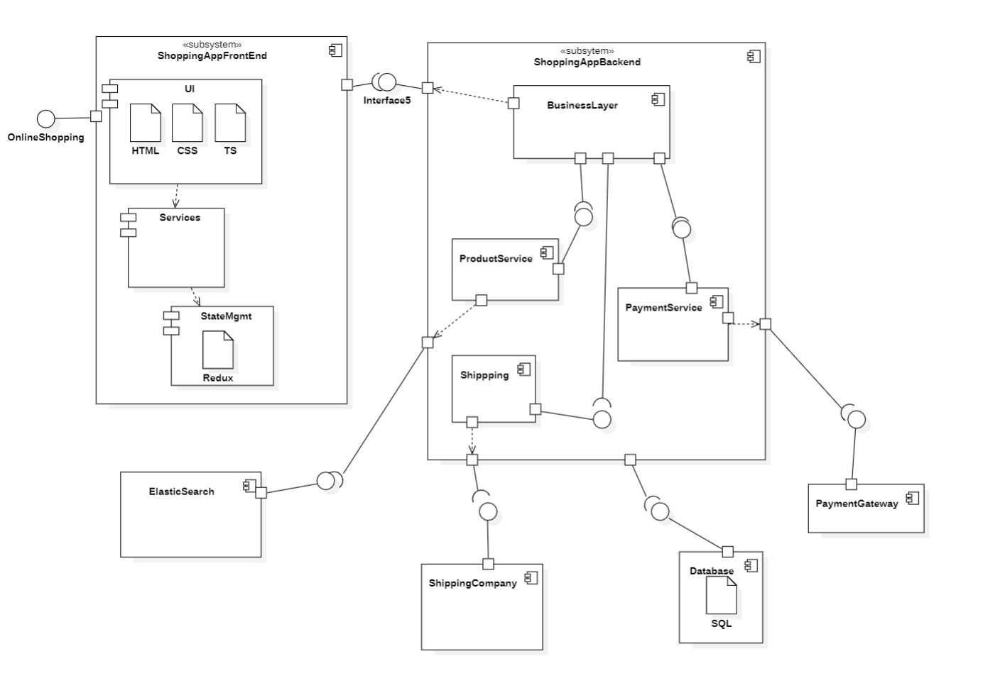

# Component Diagram

- [Component Diagram building blocks](#component-diagram-building-blocks)
- [Component Diagram Usage](#component-diagram-usage)
- [Component Diagram Example](#component-diagram-example)
---

## Component Diagram building blocks

Component diagram is a **structural diagram** which represents the static implementation view of the system.

- Help us to understand the main components of the system and the relationships between them.
- It is used to represent the structure of the system at a high level - higher than the class level

> Component Diagram = Components + Interface + relationship + Port

Component Examples
- Order
- Payment
- Shipping

**Interfaces**

- Set of operations or services that a component offers to its clients
- Defines the contract between the component and its clients

**Component Diagram**

- Set of operations or services that the component or system provides to its clients or other components

There is one component that Provide the Interface: **Provider Component**
- represented with a full circle

There is another component that Requires the Interface: **Required Interface Component**
- represented with a semi circle

**Dependencies**

Example: Payment Component depends on User Authentication Component

**Port**

- Point of interaction between the component and it's environment
- Connection point through which a component can send or receive messages

---

## Component Diagram Usage

- To model the components of the system
- To model the schemas of a database
- To model the applications of an application
- To model the system's source code

---

## Component Diagram Example

---

