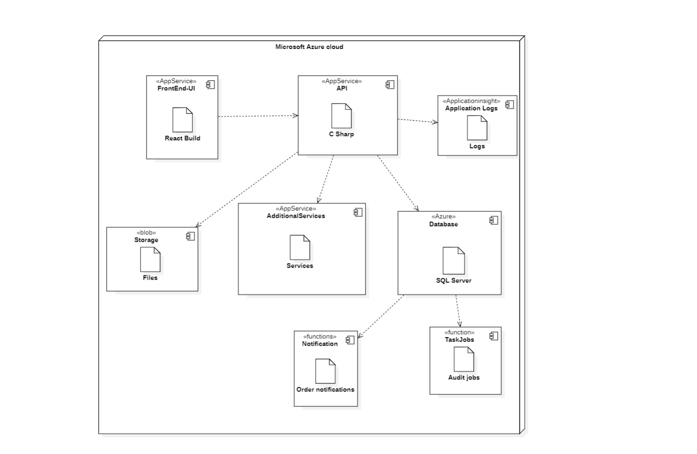
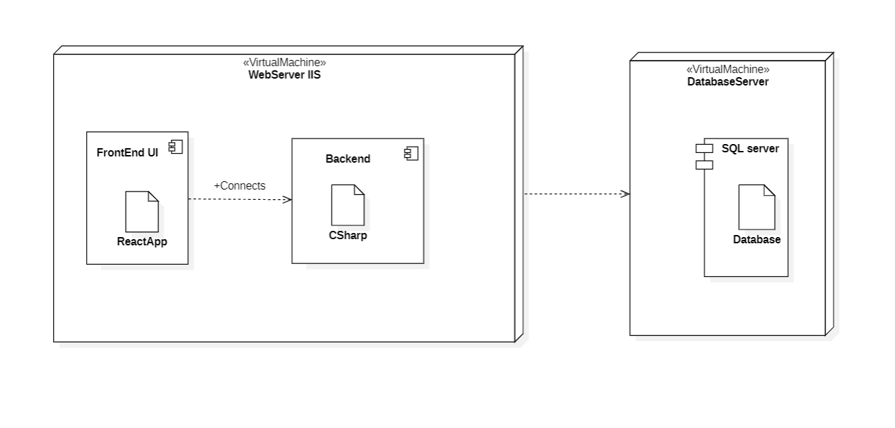

# Deployment Diagram

- [Introduction](#introduction)
- [Basics of Deployment Diagram](#basics-of-deployment-diagram)
- [Benefits of Deployment Diagram](#benefits-of-deployment-diagram)
- [Deployment Diagram Examples](#deployment-diagram-examples)
- [Common Mistakes in UML Deployment Diagrams](#common-mistakes-in-uml-deployment-diagrams)

---

## Introduction

Deployment diagram visualizes the physical hardware on which the software will be deployed

It portraits the static deployment view of the system
- Involves the nodes and their relationships
- how software is deployed on the hardware
- maps the software architecture created in design to the physical system architecture

---

## Basics of Deployment Diagram

**Node**

- Represents a physical or virtual element that is capable of executing hardware or software components
- a computing resource / environment
  - server
  - workstation
  - router
  - switch
  - cloud based platform

Real life example of a node: Web server

---

**Component**

Represents a modular, self-contained unit or software that can be deployed and executed on a node

A component can be a software module, library, executable, or other unit of code that
performs a specific function within the overall system

---

**Artifact**

- Represents a tangible item that is used or produced in the software system being deployed
  - Code files
  - Config files
  - Libraries
  - Executables
  - Scripts
  - Database Tables
  - Documentation

Note: Node contains the component so whatever fundamental of component diagram you can reuse here

---

## Benefits of Deployment Diagram

- Visualization
- Communication
- Analysis
- Maintenance
- Integration

---

## Deployment Diagram Examples

**Cloud Deployment Diagram**

---

**On prem Deployment Diagram**

---

## Common Mistakes in UML Deployment Diagrams

- Overcomplicating the deployment architecture
- Failing to identify hardware components
- Including unnecessary components
- Missing dependencies

---

