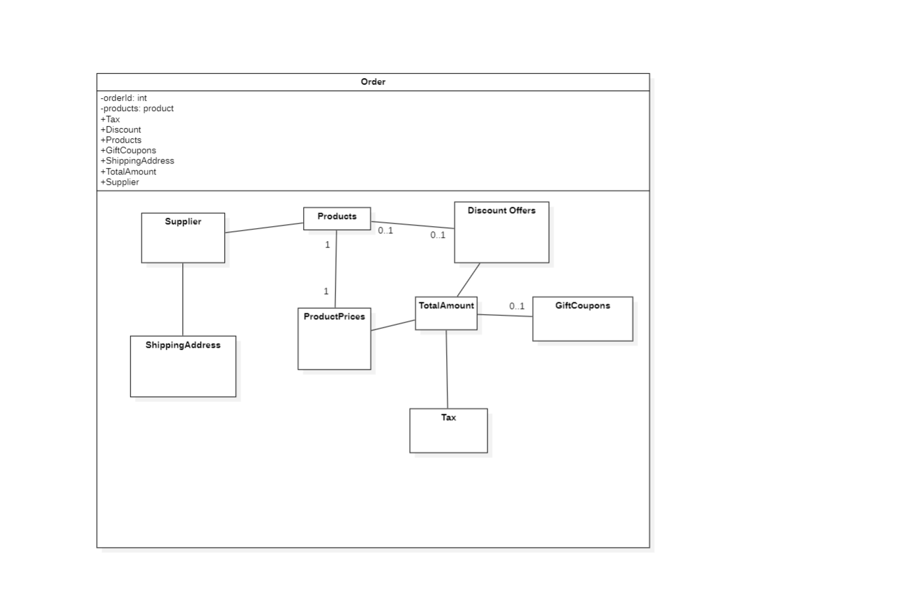

# Section 6: Composite Structure Diagram

- [Introduction](#Introduction)
- [Basics of Composite Structure Diagram](#basics-of-composite-structure-diagram)
- [Benefits of Composite Structure Diagram](#benefits-of-composite-structure-diagram)
- [Composite Structure Diagram Case Study](#composite-structure-diagram-case-study)
- [Common Mistakes in UML Composite Structure Diagrams](#common-mistakes-in-uml-composite-structure-diagrams)

---

## Introduction

Composite Structure Diagram is a type of structural diagram in UML that illustrate the internal structure of
a system or a component.

It shows the parts, components and relationships between them that make up the larger system

> A zoomed version of a component or a class

Class parts in terms of 
- methods
- functions
- variables
- relationship

Component parts
- Classes
- Packages
- How they are they are related

> Models a system from a microscopic perspective

> Depicts a **single part** rather than an entire class/component/system

---

## Basics of Composite Structure Diagram

**Components**

- Depicts the internal structure of the class or a component

**Part**
- Each part or component has it's own properties
  - Name
  - Type
  - Visibility

**Ports / Connectors**
- Represent the interaction between the parts or components

**Structural features**
- Attributes / Operations

**Multiplicity**
- Represent the number of instances of part or component

**Nesting**
- Composite Structure Diagram can depict nested components or classes

---

## Benefits of Composite Structure Diagram

- Provides a detailed view of the internal structure
- Supports hierarchical modeling
- Enables component reuse
- Facilitates sytem integration
- Supports collaboration

---

## Composite Structure Diagram Case Study

---

## Common Mistakes in UML Composite Structure Diagrams

- Overcomplicating the diagram
- Including unnecessary parts
- Missing parts or connectors
- Forgetting to include contraints
- Poorly defined relationships

---
