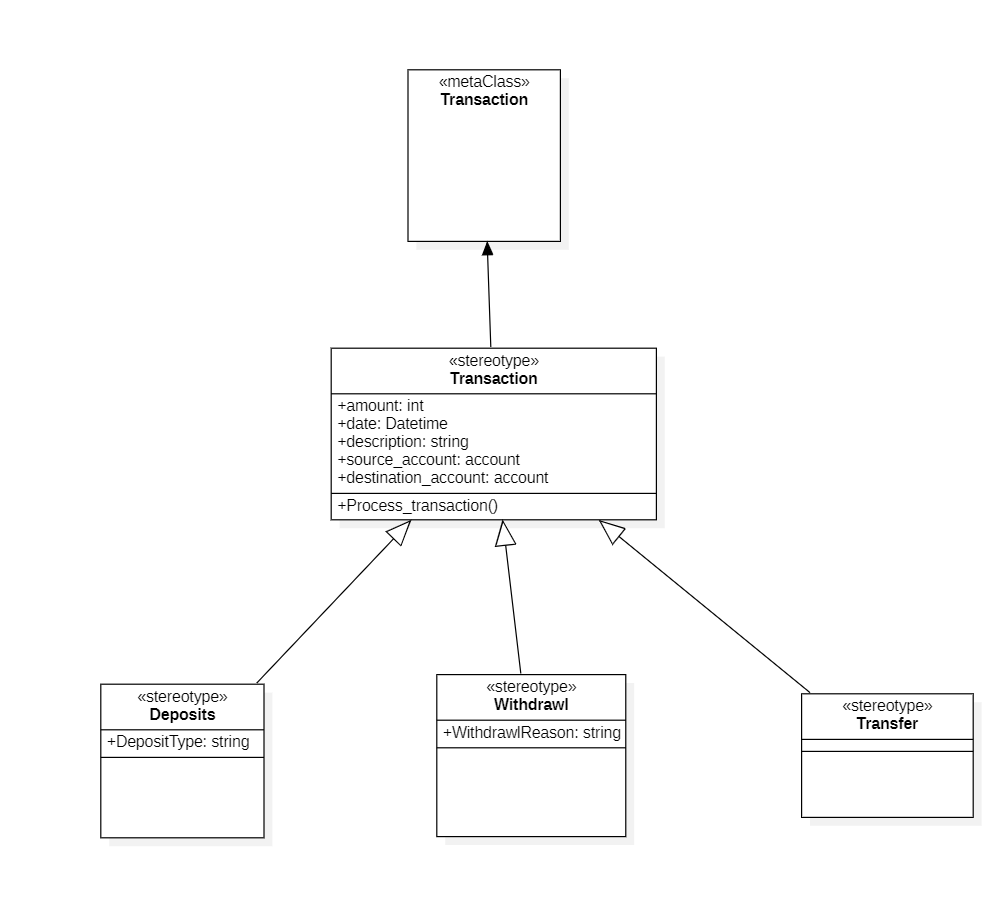
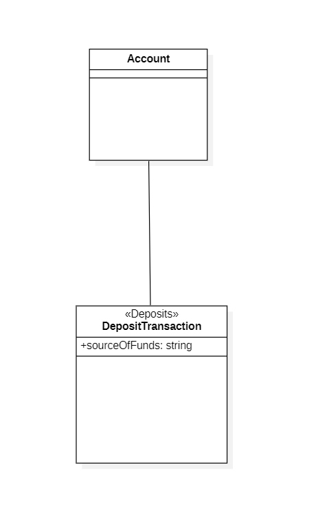

# Section 7: Profile Diagram

- [Why Profile Diagram](#why-profile-diagram)
- [Concepts of Profile Diagram](#concepts-of-profile-diagram)
- [Profile Diagram Examples](#profile-diagram-examples)
- [Common Mistakes in UML Profile Diagram](#common-mistakes-in-uml-profile-diagram)

---

## Why Profile Diagram

The generic set of tools which we have is the UML.
- UML is the Generalized Language
- UML is not optimized for specific application domain

The special custom setup tools which are tailor to specific needs are called as Profile.

Profile Diagram allow you to define, customize your own modeling language that is tailored to your specific needs.
- an extension mechanism for UML diagram
- allows you to add new building blocks / properties / new conventions / new semantics

---

## Concepts of Profile Diagram

**Stereotypes**
- special annotation that can be applied to a UML element to modify its behavior or appearance
- `<<stereotype>>`

**Tagged values**
- Customizable attribute that can be associated with a UML element
- Provides additional information about the element
- `{isSecure=true}`

**Constraints**
- Restriction or rule that applies to a UML model element
- Used to specify requirements, business rules, or other criteria

---

## Profile Diagram Examples

- Meta class, defines the structure and behavior of other classes
  - used to specify the modeling elements of a profile
- Transaction sterotype
  - Define common attributes and operations of the transaction class
- Deposits, Withdrawl, Transfer stereotypes are available to other UML diagrams

Rarely used diagram

---

## Common Mistakes in UML Profile Diagram

- Overcomplicating the profile structure
- Failing to define stereotypes
- Using too many stereotypes
- Failing to define tagged values
- Failing to define constraints
- Not considering reusability

---

