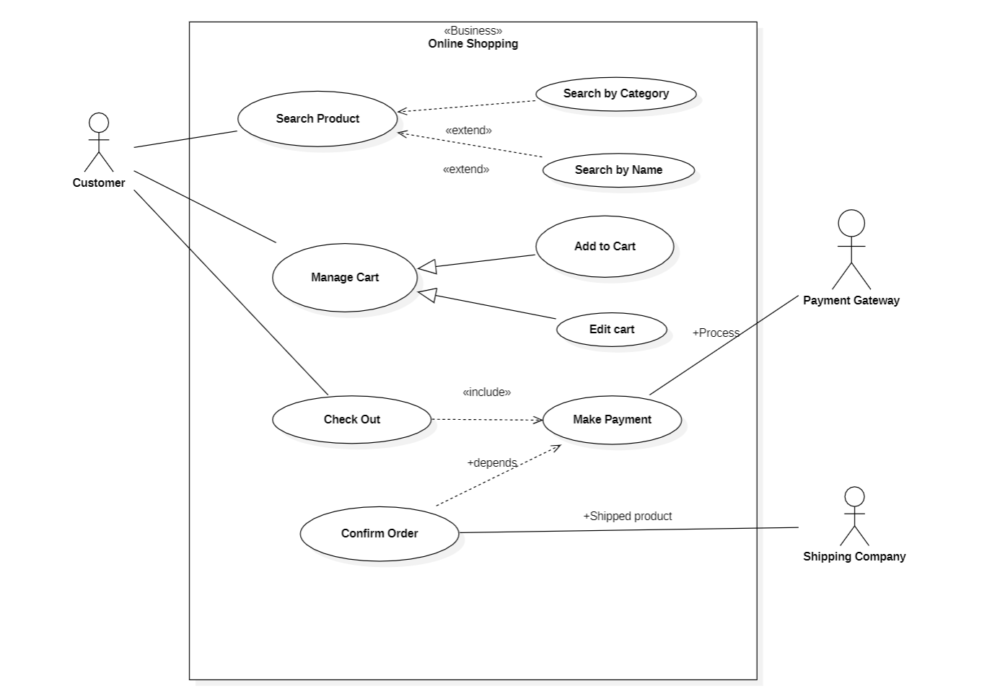
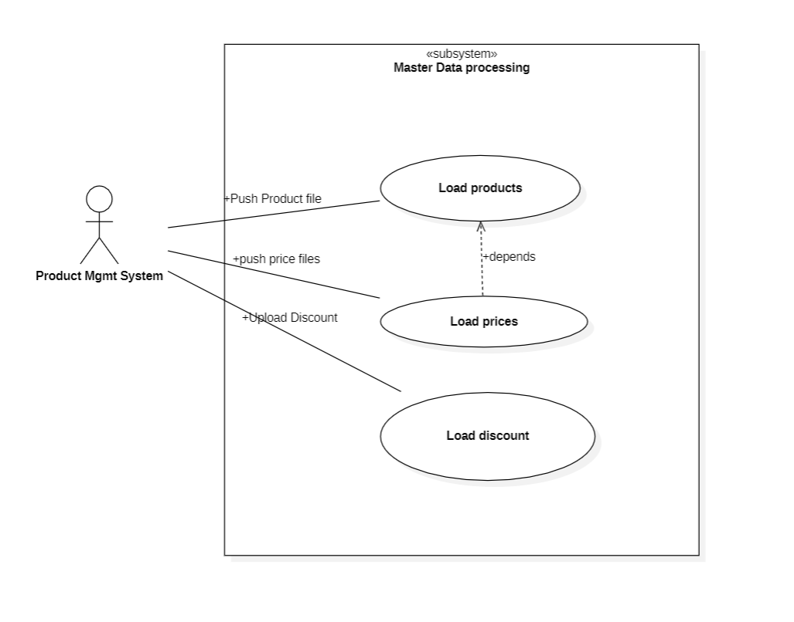

# Section 8: Use Case Diagram

- [Introduction](#introduction)
- [Actors](#actors)
- [Usecase](#usecase)
- [System Boundary](#system-boundary)
- [Relationships](#relationships)
- [Use Case Diagram examples](#use-case-diagram-examples)
- [Common Mistakes in UML Use case diagrams](#common-mistakes-in-uml-use-case-diagrams)

---

## Introduction

A type of **behavioural** UML Diagram

- Provides a representation of a system's behavior from the **perspective of the users**
- Shows how actors interact with the system
  - what tasks the system should perform
  - what outcomes are expected

---

## Actors

An actor represents a Person, Group, or External system that interacts with the sytem being modeled
- users of the system shown as stick figures
- always placed outside the system boundary
- connected through lines called associations with the use cases they interact with

Two main actors
- Primary Actors
  - Main actor who initiates a use case and has a goal to achive by interacting with the system
  - Who benefits directly from the system's functionality
  - One who triggers the use case and interacts directly with the system
- Secondary Actors
  - Assists the primary actor in achieving their goal
  - The secondary actor is not directly interested in the system's functionality and does not benefit from it
  - They play a supporting role

> Who initiates the use case and has a goal to achieve? ➡️ Primary actors

Primary actors are placed on the left, secondary actors are placed on the right of the use case

---

## Usecase

Goal or task performed by the end user, use case represent the action performed, these actions are represented by the strong verb
- describes the functional requirements in a simple way

Two types of use case
- Business use case
  - Service that is offered to the customers, business partners or other business systems
- Use case
  - Functionality that exists within a business system, which is neither visible nor accessible to outsiders
  - Represents an internal activity, meaning an internal business process

---

## System Boundary

Represents the boundary or scope of the system being modeled. It defines what is inside and outside the system.

---

## Relationships

**Association**
- A communication between an actor and a use case, user can initiate it
- represented with a line

**Generalization**
- An inheritance relationship between use cases
- Shows that one use case is a more specialized version of another use case
- Represented by an arrow connecting two use cases (**open arrow head** from specialized to more general)
  - e.g. "Add to cart" is specialized version of "Manage Cart"

**Include**

- One use case invoked by another use case
- cannot stand alone (represented by a **dashed arrow**, from the base to the included)
  - e.g. Checkout -- << include >> + Uses -->  Enter Shipping Information

**Extend**
- Represents an optional or alternative functionality of a use case.
- It shows that one use case extends the funtionality of another use case *under certain conditions*
- Represented by a dashed arrow (from extension use caase to the base)
  - with stereotype << extend >>
  - example "View Cart" <-- << extend >> + Apply coupon -- "Apply Coupon" 

**Dependency**

- It shows that one element depends on another element in order to function correctly
- represented by a dashed arrow
  - with stereotype notation << dependency >>
  - example Process Payment -- << dependency >> + Verify --> Verify Payment Information

---

## Use Case Diagram examples

**Business Use case**

**System use case**

---

## Common Mistakes in UML Use case diagrams

- Failing to identify actors
- Using technical language
- Overcomplicating the diagram
- Failing to define system boundaries
- Including non-functional requirement
- Not considering alternate flows
- Not prioritizing use cases
- Not considering stakeholders

---

