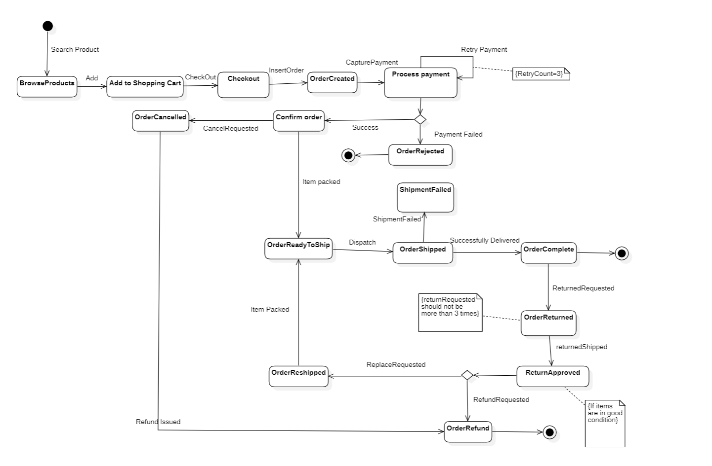

# Section 10: State Machine Diagram

- [Introduction](#introduction)
- [Basics of State Machine Diagram](#basics-of-state-machine-diagram)
- [Benefits of State Machine Diagram](#benefits-of-state-machine-diagram)
- [State Machine Diagram Example](#state-machine-diagram-example)
- [Common Mistakes in UML State Machine Diagrams](#common-mistakes-in-uml-state-machine-diagrams)

---

## Introduction

State Machine Diagram is used to model the **different states** of the object in a system
- Focuses on the **dynamic aspects** of the system

also referred as 
- State Chart Diagram
- State Transition Diagram
- Finite State Machine Diagram
- State Diagram

Should be used **if your projects has scenarios where the object goes through lot of complicated states and transitions**

---

## Basics of State Machine Diagram

**States**
- Represents **a moment of an object or system** at a given time in its lifespan
- Initial state: Filled circle
- Final state concentric circles

**Transitions**

Represent **a change in the state of an object or system** in response to an event or condition
- arrows that connect source state and target state, labelled with triggering an event

**Event**

Is **a trigger or a stimulus** to perform an action
- e.g. pressing a button

**Guards**

**Conditions or constraints** that must be met in order for a transition to occur

also uses common concepts like
- Decision box
- Join Node
- Fork Node

---

## Benefits of State Machine Diagram

- Visualizing system behavior
- Identifying system states and transitions
- Improving communication and collaboration
- Detecting errors and inconsistencies
- Simplifying testing and debugging

---

## State Machine Diagram Example

---

## Common Mistakes in UML State Machine Diagrams

- Failing to identify states
- Failing to define transitions
- Failing to define actions
- Failing to define guards
- Not considering entry and exit actions for states

---

