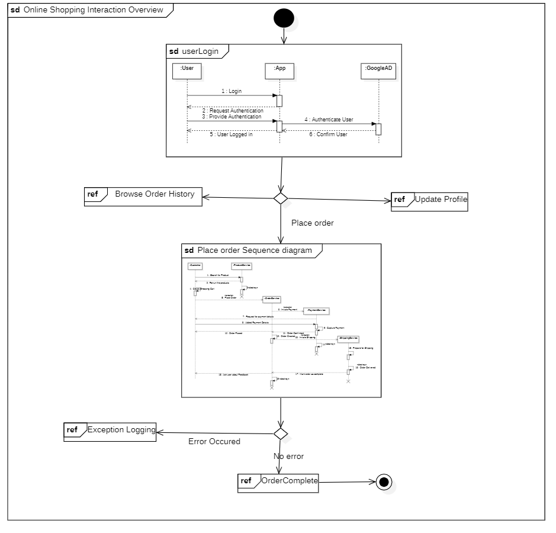

# Section 14: Interaction Overview diagram

- [Introduction](#introduction)
- [Basics of Interaction Overview Diagram](#basics-of-interaction-overview-diagram)
- [Benefits of Interaction Overview Diagram](#benefits-of-interaction-overview-diagram)
- [Interaction Overview Diagram Example](#interaction-overview-diagram-example)

---

## Introduction

- Form of activity diagram
- It can include
  - Sequence diagram
  - Communication diagram
  - Timing diagram
  - Interaction Overview Diagram

> Interaction Diagram = Activity diagram + Sequence diagram

A Diagram of diagrams.

It is an activity diagram of the interaction diagrams

Interaction nodes are part of the interaction diagram

---

## Basics of Interaction Overview Diagram

Same concepts as in the activity diagram
- Initial Node
- Final Node
- Decision Node
- Merge Node
- Fork Node
- Join Node

But also

**Interaction**

Represents a behavior that is performed by the system or application.

Involves a sequence of messages exhanged between different components of the system.

**Interaction Use**

Represent the reuse of an existing interaction within an Interaction Overview Diagram

---

## Benefits of Interaction Overview Diagram

- Simplification of complex interactions
- Visualization of control flow
- Identification of alternative scenarios
- Reusability
- Enhanced collaboration

---

## Interaction Overview Diagram Example

---

## Common Mistakes in UML Interaction Overview Diagram

- Overcomplicating the diagram
- Not clearly distingishing between actions and interactions
- Not including all necessary interactions
- Using too many control flows
- Not considering alternate scenarios

---

